# Infinix 全球资源运营系统

面向跨市场品牌团队的 KOL、媒体与创作者运营工作台：从发现资源、制定投放计划，到项目协作、内容追踪和效果复盘，把分散在表格、社媒平台与沟通工具里的信息连接起来。

> 这是项目与技术实现介绍，不是可公开访问的演示账号。截图用于展示产品界面，数据随时间变化；公开仓库不提供生产环境账号、联系人或凭证。

## 产品解决什么问题

海外达人营销往往跨国家、平台、团队和供应商。资源资料重复维护、账号数据口径不一、邀约与交付进度散落在聊天记录里，投放结束后也难以把内容表现与成本关联。本系统用“资源主档 + 项目执行 + 内容数据 + 分析推荐”的结构，帮助团队形成可复用的运营资产。

| 运营环节 | 平台能力 | 对团队的价值 |
| --- | --- | --- |
| 找人 | 全球资源库汇集达人与媒体档案、平台账号、市场/领域标签和近期表现 | 跨市场筛选、对比候选资源，减少重复搜集 |
| 定策略 | 智能资源助手结合需求、市场、平台、预算等条件生成候选与推荐理由 | 加快初筛，并保留人工复核与选择 |
| 做投放 | 项目管理关联合作资源、内容、执行阶段、预算和负责人 | 统一推进邀约、议价、交付与发布 |
| 看效果 | 内容资产与项目报告追踪曝光、互动、CPM 等指标 | 对比资源和平台表现，为下一轮投放提供依据 |
| 沉淀经验 | 标签、治理规则与数据同步连接资源档案和合作历史 | 让一次合作的经验可被后续项目复用 |

### 与社媒、海外达人运营和增长的关系

这不是单一的“达人名单”工具，而是围绕社媒与海外投放的协同系统：团队可以从不同市场和平台识别合适的创作者，在项目中组织合作与内容发布，再按内容表现和成本做复盘。对增长团队而言，它提供的是**选人、执行、衡量和迭代的基础设施**，便于持续优化内容触达、互动效率和预算分配；实际销量、获客或 ROI 仍取决于归因数据、渠道策略与具体执行，不应由平台界面直接推断。

## 核心模块

### 项目管理：把 Campaign 变成可追踪的执行流程

项目列表展示合作资源、内容量、曝光/播放、互动率、目标市场和对接人，并支持搜索、导入与进入项目。项目详情按“概览—达人/媒体—内容”组织：概览查看内容、平台效果及执行信息；达人/媒体页管理合作对象与合作阶段；内容页关联发布作品及其数据。预算、效果报告和项目信息与执行页相连，便于从单条内容追溯到项目结果。导入模板支持将既有项目数据迁入，减少从零录入。

项目列表（筛选单个项目）：

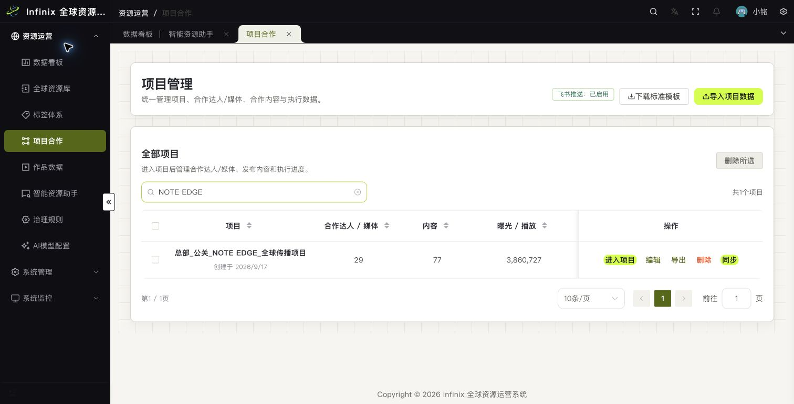

项目详情的达人/媒体页（筛选单个合作资源，展示跨平台表现与合作状态）：

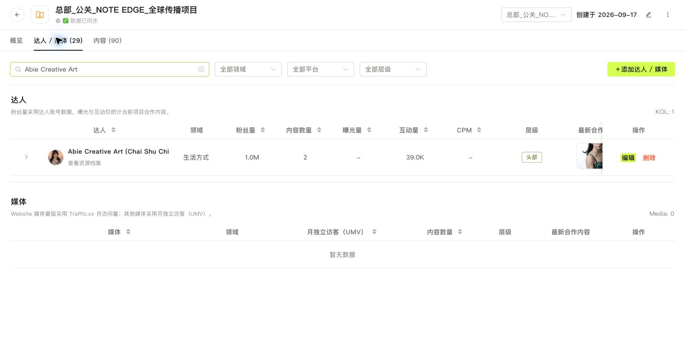

项目详情的内容页（关联社媒发布作品与内容表现）：

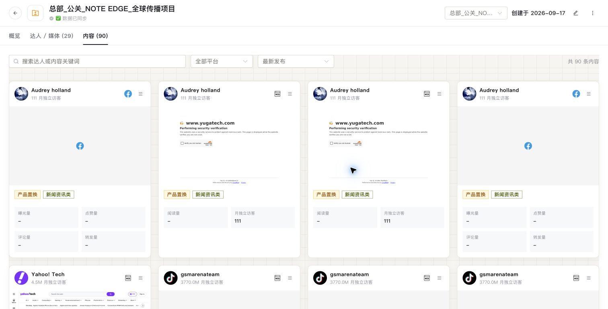

### 全球资源库：可复用的达人与媒体主档

资源库提供名称、账号、类型、国家/地区、粉丝量等筛选入口，集中展示平台账号、基础表现、合作数据与近期作品。资源档案进一步查看平台维度指标、内容表现和合作历史。资源不只属于一次 Campaign：项目合作结束后，档案和历史表现仍可为下一轮选人服务。

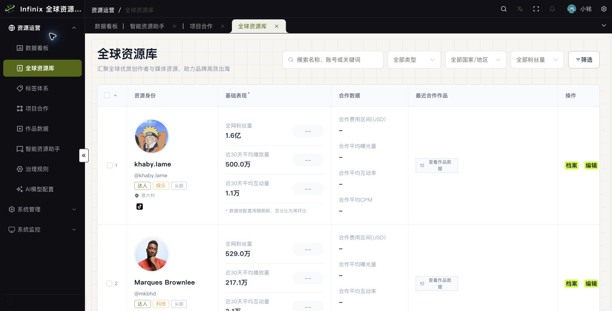

资源档案展示单个创作者的平台指标与近期作品：

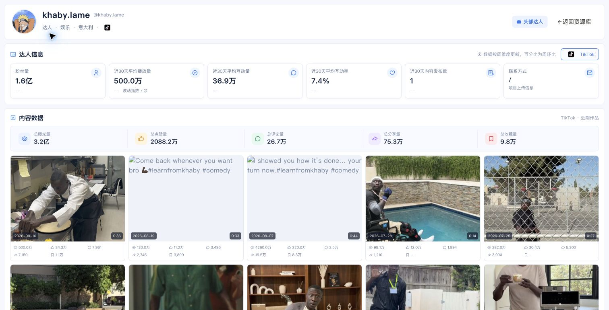

### 数据看板与智能资源助手

数据看板按市场、资源类型和平台观察资源覆盖、内容资产、曝光、互动以及创作者表现。智能资源助手接收项目需求并给出候选排序、匹配理由及风险提示，支持将匹配资源加入项目候选池。推荐采用规则与可配置模型协同；模型不可用时可以回退到本地规则，最终合作决策由运营人员确认。

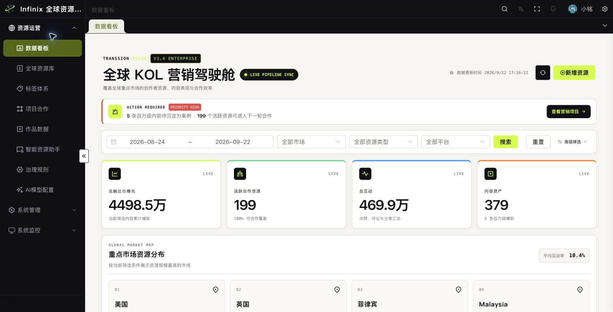

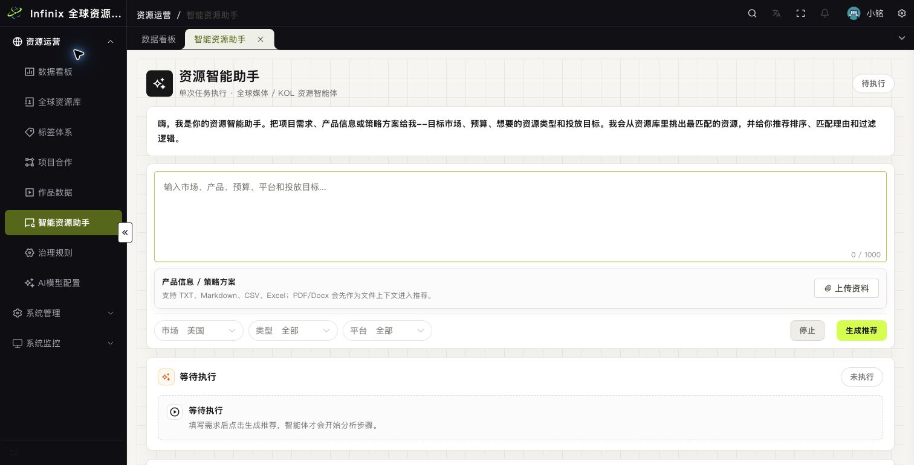

### 标签、作品与治理

标签体系为资源和内容提供统一分类；作品数据连接社媒内容与资源/项目；治理规则和模型配置帮助维护数据口径、评分与推荐策略。它们共同支撑跨市场协作，而不仅是增加后台菜单。

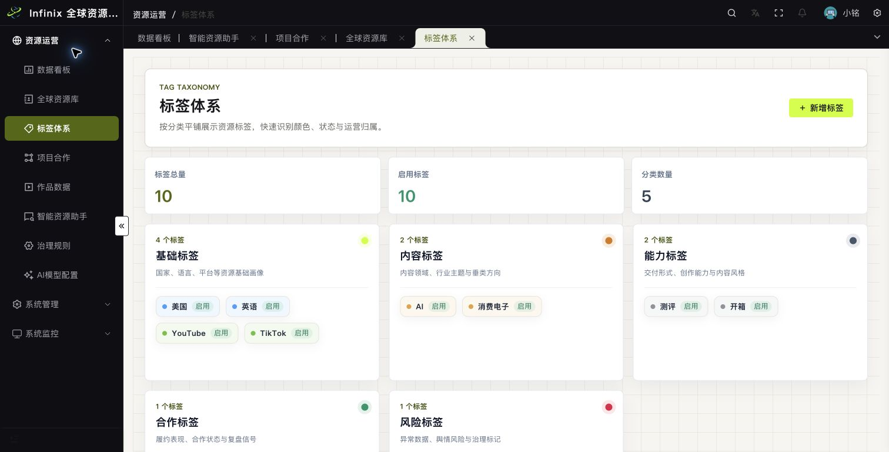

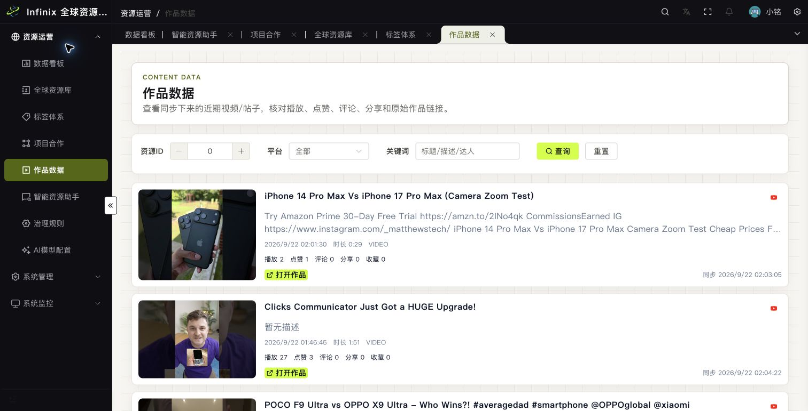

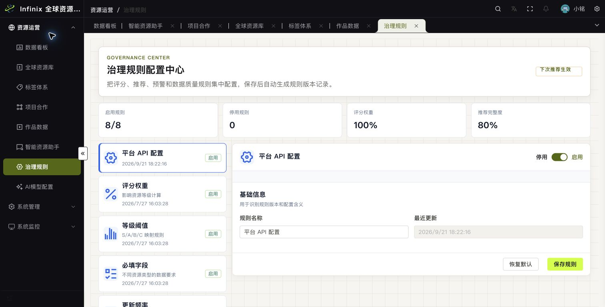

## 从 AI 初创公司视角看

这个项目的产品价值，在于为 AI 能力准备了可操作的业务底座，而非只在界面里加入聊天框：

1. **结构化上下文**：资源、平台账号、项目、合作和内容数据彼此关联，使推荐能基于真实约束，而非孤立关键词。
2. **人机协作闭环**：AI 可协助解析需求、筛选候选和解释推荐，运营人员仍负责品牌适配、商务判断与风险复核。
3. **反馈可积累**：投放后的内容表现与合作记录可回流到资源判断中，让下一次选择更有依据。
4. **跨市场可扩展**：统一资源主档和项目流程有利于不同国家、团队及供应商共享工作方式，降低重复建库成本。
5. **可降级的技术路径**：规则推荐、模型配置和后端边界分离，避免关键运营流程完全依赖单次模型响应。

这些是基于当前功能设计与实现的优势，不代表已经验证了商业收入、推荐准确率或增长提升；这些结果需要在真实投放中持续测量。

## 技术组成

- 前端：Vue 3、TypeScript、Vite、Element Plus，位于 [`vue-pure-admin`](./vue-pure-admin)。
- 后端：Go + MySQL，提供认证、业务 API、同步与推荐编排，位于 [`backend`](./backend)。
- 数据采集与同步：独立采集插件/服务与平台 API 接入，位于 [`collector-plugins`](./collector-plugins) 和 [`collector-services`](./collector-services)。
- 详细组件边界见[系统架构说明](./docs/system-architecture.md)，产品需求背景见[PRD](./PRD.md)。

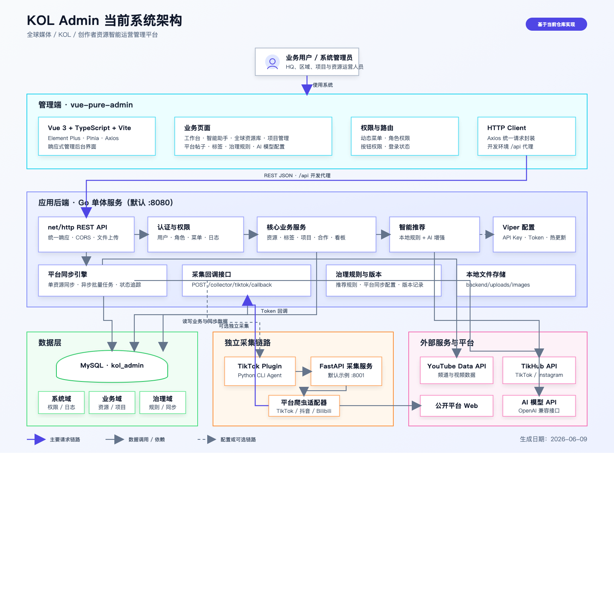

## 本地开发

先按 [`backend/README.md`](./backend/README.md) 配置 MySQL、迁移与后端运行环境，再启动前端：

```bash
cd vue-pure-admin
pnpm install
pnpm dev
```

前端开发环境默认通过 `/api` 代理到本机后端。生产部署需要单独配置数据库、SSO、平台 API 与模型密钥；不要将这些配置或真实业务数据提交到公开仓库。

## 截图与数据说明

截图仅代表 2026-09-22 拍摄时的界面状态，列表和详情中展示了少量项目名称及运营指标。本文未展示联系人、凭证、具体合作报价及含预算的项目概览；更完整的业务数据应在经授权的环境查看。
