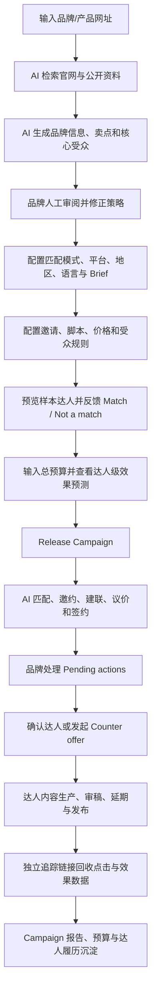

# AhaCreator 项目参考分析

> 调研对象：[AhaCreator Overview](https://www.ahacreator.com/resources/aha-overview)
> 调研日期：2026-06-14
> 对照项目：`kol_star` 全球传播资源智能运营平台

## 一、结论先行

AhaCreator 不是一个单纯的“达人搜索工具”，也不是传统 Agency 的线上管理后台。它更接近一个由 AI 执行达人营销流程、由品牌在关键节点决策的双边协作与交易平台。

它希望解决的核心问题不是“如何查到更多达人”，而是：

1. 如何持续找到真实、匹配且可合作的达人。
2. 如何自动完成建联、跟进、报价收集和议价。
3. 如何让数百位达人按照统一流程并行履约。
4. 如何在内容验收、数据追踪和资金结算环节降低风险。
5. 如何把一次性达人合作沉淀为可复用、可复盘的组织能力。

一句话概括：

> **AhaCreator 是一个以 Campaign 为核心、AI 负责执行、人负责关键决策的全球达人营销运营平台。**

当前 `kol_star` 与 AhaCreator 的方向高度相关，但两者所处阶段和产品边界不同：

- `kol_star` 当前更像企业内部使用的全球 KOL/媒体资源资产库与项目运营后台。
- AhaCreator 更像面向品牌和达人双方、包含执行服务与交易保障的商业化平台。
- `kol_star` 已经具备资源、推荐、项目、合作记录、效果复盘和治理规则等良好基础。
- 当前最值得参考的不是直接建设完整双边平台，而是补齐 **Campaign 标准工作流、批量执行状态、异常预警、达人履历与预测/实际对比**。

## 二、AhaCreator 是什么项目

### 2.1 产品定位

AhaCreator 将达人营销中重复、耗时、难以规模化的执行工作交给 AI，包括：

- 达人搜索与匹配
- 建联与多轮跟进
- 报价收集与议价
- 合作信息与授权收集
- 协议与履约推进
- 催稿、内容审核协作与发布提醒
- 素材授权
- 营销效果与数据回收

品牌团队主要负责少量高价值决策：

- 创建 Campaign，定义市场目标、内容方向和预算
- 确认达人名单与最终价格
- 审核达人稿件
- 查看数据并进行复盘调优

其产品理念可以概括为：

> AI 负责持续执行，人负责策略、判断、审核与创造。

### 2.2 目标用户

AhaCreator 更适合以下团队：

- 产品已经成熟，有明确市场和使用场景。
- 将达人营销视为长期增长渠道，而不是单次尝试。
- 同时运营多个国家、平台或 Campaign。
- 每个项目需要并行合作大量达人。
- 团队的主要瓶颈已经从策略转变为执行效率。

对于只偶尔合作少量达人、仍在验证渠道价值的团队，平台带来的流程和交易能力可能偏重。

### 2.3 核心价值

| 传统问题 | AhaCreator 的解决思路 |
| --- | --- |
| 找人依赖关键词、表格和个人经验 | AI 生成目标画像，经过召回、粗排、精排形成推荐名单 |
| 建联与跟进消耗大量人力 | AI 自动发送个性化邀约并进行多轮跟进 |
| 报价不透明、议价依赖个人经验 | 收集报价、预测合理价格并协助议价 |
| 项目状态散落在聊天和表格中 | 将达人合作拆解为统一、实时可见的状态 |
| 延期和内容风险发现太晚 | 持续监控进度，异常提前预警 |
| 效果数据回收不完整 | 按 Campaign 和达人追踪播放、点击、CPM、CPC 等指标 |
| 不交付或内容不合规造成资金风险 | 预算托管，验收后按节点释放 |
| 项目扩大后管理成本线性增长 | AI 并行推进大量达人，品牌只处理关键节点 |

## 三、AhaCreator 的产品闭环

### 3.1 标准工作流

```mermaid
flowchart LR
    A["品牌创建 Campaign"] --> B["AI 解析需求并匹配达人"]
    B --> C["品牌反选候选达人"]
    C --> D["AI 建联、跟进与收集报价"]
    D --> E["品牌确认达人和价格"]
    E --> F["授权与合作条件校验"]
    F --> G["达人制作内容"]
    G --> H["品牌审核稿件"]
    H --> I["AI 催稿并监控发布"]
    I --> J["数据追踪与效果报告"]
    J --> K["复盘并沉淀达人履历"]
```



这个闭环中，产品的关键不是拥有多少页面，而是每一步都有明确输入、输出、负责人、状态和异常处理方式。

### 3.2 达人匹配机制

AhaCreator 描述了一套三级匹配流程：

1. **召回**：大模型根据品牌、产品、受众和内容风格生成目标画像，从大规模达人库中召回语义相关候选。
2. **粗排**：依据目标市场、语言、活跃度、真实性、反作弊和营销号识别等规则过滤。
3. **精排**：判断达人是否适合产品、受众是否可能购买、内容表达是否自然、推广价值是否足够，最终生成匹配分。

这比单纯按粉丝量、国家和平台筛选更接近真实业务判断。

### 3.3 执行自动化

AhaCreator 的主要差异化并不只在推荐，而在推荐之后：

- 自动发送达人邀约。
- 按节奏进行多轮跟进。
- 收集合作意向、报价和条件。
- 根据品牌期望价格继续议价。
- 监控内容制作和发布日期。
- 进行催稿、Brief 与 CTA 检查。
- 自动追踪合作数据。

这使其从“发现工具”跨越到了“执行平台”。

### 3.4 风险与交易保障

AhaCreator 将风险控制前置到流程中：

- 合作前校验达人身份、品牌资质和授权。
- 合作中检查 Brief、CTA 和平台规范。
- 持续监控延期和内容风险。
- 品牌预算进入托管，在内容交付并验收后释放。
- 对不交付、不合规、刷量或低质量内容不付款。

这部分能力意味着 AhaCreator 不只是软件，还承担了一部分平台责任、交易责任和运营责任。

### 3.5 Demo 原型完整业务流程确认

根据 Navattic Demo 与用户提供的 16 张完整流程截图，可以确认其真实产品逻辑如下：



#### 3.5.1 创建 Campaign：AI 先生成，品牌再校准

创建流程不是传统的长表单填写，而是以产品 URL 为起点：

1. 品牌输入产品或官网 URL。
2. AI 浏览产品官网并搜索公开信息。
3. AI 总结并生成品牌基础资料、业务介绍、品牌亮点、核心卖点和受众画像。
4. 品牌在同一页面审阅、修改、增删 AI 生成内容。
5. 这些结构化信息成为后续达人匹配、推荐解释和内容 Brief 的依据。

关键产品判断：

- AI 不是直接替用户发布 Campaign，而是先完成高成本的信息整理。
- AI 生成结果保持可编辑，用户拥有最终控制权。
- 品牌卖点和受众不是普通备注，而是匹配模型的核心输入。
- 产品通过展示“搜索、总结、生成”等执行步骤，建立 AI 工作透明度。

#### 3.5.2 Campaign 设置：同时控制匹配规模和执行策略

设置页将策略分成三层：

| 层级 | 配置内容 | 业务作用 |
| --- | --- | --- |
| 匹配策略 | Focus、Scale、Max scale | 在匹配准确度、候选规模、价格和执行速度之间取舍 |
| Campaign 基础设置 | 平台、地区、语言、发布日期、目标链接、Brief | 定义硬性合作要求和最终交付目标 |
| 高级设置 | 参考达人、黑名单、品牌素材、产品视频、邀请模式、脚本要求 | 向 AI 提供正负样本和执行规则 |
| 达人高级筛选 | 最低播放、粉丝、发帖频率、最近发布、最高 CPM、最高单价、受众性别和年龄 | 控制进入候选池的硬性门槛 |

其中最值得参考的是：

- **匹配模式产品化**：不暴露复杂模型参数，而是提供 Focus、Scale、Max scale 三种业务语言选项。
- **正负样本输入**：参考达人用于查找相似人群，黑名单用于明确排除。
- **自动与人工模式并存**：邀请可以自动发送，也可以设置为品牌审核名单后再发送。
- **流程可裁剪**：可以要求达人先提交 Idea/Script，也可以关闭并直接进入内容制作。

#### 3.5.3 样本匹配预览：发布前校准 AI

在正式发布 Campaign 前，系统先展示样本达人：

- 达人基础数据和预计单帖播放量
- 所属匹配模式
- 具体匹配理由
- `Match` 与 `Not a match` 反馈

这一步的业务意义不只是预览，而是发布前的人机校准：

1. 让用户提前判断 AI 是否理解了产品与目标人群。
2. 通过正负反馈修正当前 Campaign 的匹配方向。
3. 在大规模匹配和邀约前发现配置问题，避免浪费预算与触达机会。

当前 `kol_star` 智能资源助手已经能输出推荐理由，适合直接增加“符合 / 不符合 + 原因”反馈，并将反馈存入项目级推荐偏好。

#### 3.5.4 预算与结果预测：发布前形成投入产出预期

预算页将总达人预算与结果预测放在同一决策页面：

- 总达人预算
- 预计总播放量
- 预计 CPM
- 预计点击量
- 预计 CPC
- 样本达人预计报价
- 每位达人预计 CPM、播放、CPC 与点击区间

这证明 AhaCreator 的预算不是简单财务字段，而是：

> **预算决定可邀请与可合作达人规模，达人组合反向决定 Campaign 预计结果。**

产品使用区间预测，而不是单点预测，可以降低用户对结果确定性的误解。发布后还允许调整预算，说明 Campaign 被视为持续运营对象，而不是一次性提交表单。

#### 3.5.5 Campaign 工作台：AI 执行，人只处理待决策事项

Campaign 发布后的工作台分为四层：

1. **整体执行进度**
   - Review campaign
   - Match influencers
   - Negotiate price & settle contract
   - View influencer application

2. **平台价值与风险提示**
   - 自然流量
   - 交付保障
   - 最低价格
   - 建议额外确认达人以对冲延期和不交付风险

3. **Pending actions**
   - 审核达人最新报价
   - 确认合作
   - 显示等待时长和紧迫程度

4. **达人执行列表**
   - 邀请达人 / 已建立合作
   - 按状态、语言、平台和更新时间筛选
   - 展示匹配分、报价、最低 CPM、预测播放和快捷操作

最重要的设计原则是：

> 品牌不需要逐条查看 AI 正常推进中的任务，只需要处理 AI 无法替品牌决定的 Pending actions。

这非常适合当前项目。首页和项目详情页应优先展示“今天需要人处理什么”，而不只是统计资源总量。

#### 3.5.6 达人合作状态机

Demo 中可以确认的达人状态包括：

```text
New candidates
→ Rate negotiation
→ Pending kickoff
→ Script under production
→ Content under production
→ Pending publish
→ Ads published

任意阶段 → Canceled
```

此外，报价环节还有更细的状态：

```text
Offer under influencer review
↔ Influencer rate under review
→ Collaboration established
```

这说明 Campaign 的整体状态与 Campaign 内每位达人的合作状态是两个不同层级，不能只在项目表中保留一个 `status` 字段。

#### 3.5.7 达人决策详情：把推荐、报价和风险集中到一个页面

品牌确认达人前，可查看：

- 达人基础资料、平台、语言、粉丝量和评分
- 最近活跃、高互动率、真实性、信用等平台保障信号
- 当前最佳价格和完整报价历史
- 最低 CPM、预测 CPC、预测点击与预测品牌内容播放
- 最近 20 条作品的中位数表现
- AI 识别的受众主题与整体匹配分
- 实际受众地区、年龄和性别
- 收藏、举报、移除、确认合作和还价操作

几个值得借鉴的细节：

- 使用最近作品的**中位数**而不是平均数，减少爆款对判断的干扰。
- “受众主题匹配”与“受众地区/年龄/性别匹配”分开展示。
- 推荐结论旁边直接放置报价和预测效果，让品牌做完整商业决策。
- 真实性、信用和履约信号作为平台背书独立展示。

#### 3.5.8 议价：结构化记录双方报价

还价弹窗包含：

- 达人当前报价
- 品牌新报价
- 是否设为不可议价
- 达人报价与品牌报价的完整历史

业务上这是一个双向 Offer 状态机：

```text
达人报价 → 品牌接受
达人报价 → 品牌还价 → 达人接受
达人报价 → 品牌还价 → 达人再报价 → 继续协商
任一方拒绝 → 取消合作
```

报价历史必须独立建模，不能只用合作记录上的一个 `quote_amount` 覆盖更新，否则无法分析议价幅度、响应时间和成交效率。

#### 3.5.9 内容交付：每位达人拥有独立履约时间线

合作确定后，达人详情页切换到内容交付工作区，包含：

- 独立追踪链接
- 约定发布时间窗口
- Idea/Script 提交或跳过
- Kickoff 完成
- 延期申请、原日期、新日期、原因与审批结果
- 视频草稿、链接、Caption、缩略图和审核状态
- 最终发布链接与截止时间
- 从达人申请到最终发布的完整事件时间线

这不是一个简单的“交付状态”字段，而是一套可审计的履约事件系统。每个事件需要记录：

- 事件类型
- 发起方
- 提交时间
- 原计划时间与新计划时间
- 说明与附件
- 审核人
- 审核结果

#### 3.5.10 Campaign 信息与自动审批

Campaign 发布后仍可查看和修改：

- 品牌 Brief 与内容规范
- 黑名单、参考达人和品牌素材
- 自动审批匹配分门槛
- 各平台 CPM 上限
- 各平台 CPC 上限

这说明系统允许将部分品牌决策规则化：

- 高匹配、低成本的达人自动进入内容制作。
- 超出价格或效率门槛的达人进入人工待办。
- Campaign 运行期间规则仍可调整。

这与当前 `kol_star` 的治理规则非常契合，可以把全局治理规则与项目级规则分开：全局规则控制底线，项目规则控制本次 Campaign 的策略。

### 3.6 逐图业务逻辑确认

| 图片 | 页面/动作 | 确认的业务逻辑 |
| --- | --- | --- |
| 图 1 | Budget and results | 输入总预算，系统按候选达人组合预测价格、播放、点击、CPM 和 CPC |
| 图 2 | Campaign Collaboration 首页 | 展示整体自动执行进度、平台保障、风险建议和待处理事项 |
| 图 3 | 达人列表 All 状态 | 邀请与合作达人统一管理，支持多维筛选、匹配分、报价和预测效率对比 |
| 图 4 | New candidates / Established collaborations | 邀请候选与已确认合作分层，确认合作后进入履约流程 |
| 图 5 | 达人受众详情 | 依据近期内容、语义受众、地区、年龄和性别判断匹配程度 |
| 图 6 | Rate negotiation | 独立查看议价中的达人，品牌需处理 AI 无法最终决定的报价 |
| 图 7 | 达人决策详情 | 汇总推荐证据、预测效果、报价、受众和操作，供品牌确认或还价 |
| 图 8 | Make a counter offer | 记录双方报价历史，可设置最终不可议价报价 |
| 图 9 | Content delivery | 用事件时间线管理脚本、草稿、延期、审核、发布和追踪链接 |
| 图 10 | Campaign Advanced settings | Campaign 运行中仍可维护 Brief、正负样本和自动审批阈值 |
| 图 11 | 输入官网 URL | 以最低输入成本启动 Campaign 策略生成 |
| 图 12 | AI thinking | 可视化展示 AI 搜索、总结和生成过程，建立信任与可控感 |
| 图 13 | Basic information | AI 生成品牌信息、卖点和核心受众，品牌负责审阅修正 |
| 图 14 | Settings | 设置匹配模式、平台市场、邀请模式、脚本要求和高级筛选 |
| 图 15 | Preview sample matches | 发布前用样本达人和正负反馈校准匹配方向 |
| 图 16 | Release Campaign | 发布前再次确认预算、预计结果和达人级预测，然后启动自动执行 |

### 3.7 Demo 对当前项目的直接启发

结合原型，当前项目最应该优先补齐的不是更多独立菜单，而是以下五个核心工作区：

1. **AI Campaign 创建向导**
   - 输入产品资料或 URL。
   - AI 生成产品介绍、卖点、目标受众和建议筛选条件。
   - 用户审阅后创建项目。

2. **样本推荐校准页**
   - 展示少量代表性资源、推荐理由和预测结果。
   - 收集符合、不符合和原因反馈。
   - 反馈只影响当前 Campaign，确认后再进行全量推荐。

3. **Campaign 执行控制台**
   - 顶部展示整体漏斗。
   - 中部只展示 Pending actions 和风险。
   - 下部按达人状态管理执行列表。

4. **达人合作决策页**
   - 将公开表现、历史合作、报价、预测效果、匹配理由、风险和受众洞察放在同一页。
   - 支持确认、移除、收藏、报价审批和备注。

5. **达人履约时间线**
   - 统一记录合作确认、脚本、草稿、修改、延期、发布和效果回收。
   - 所有状态变化由事件驱动，并可追溯。

## 四、与当前 `kol_star` 项目的对照

### 4.1 当前项目已有能力

根据当前仓库代码和数据库结构，`kol_star` 已经具备：

- 全球 KOL、创作者、媒体与代理商资源库
- 国家、语言、平台、行业、标签、评分、等级和风险信息
- YouTube、Instagram、TikTok 等平台数据同步及作品沉淀
- 自然语言需求解析与智能资源推荐
- 本地规则推荐与 AI 模型推荐回退机制
- 资源推荐理由、预估成本和风险提示
- 项目需求、候选资源和合作记录
- 合作状态、交付状态、发布日期和发布链接
- 曝光、播放、点击、转化、互动、评论和 ROI 回填
- 项目复盘、智能效果摘要和资源评分治理
- 数据可信度、推荐规则、预警规则和版本治理

因此，当前项目不是从零起步。它已经覆盖了 AhaCreator 闭环的“资源沉淀、匹配推荐、项目记录、效果复盘”四个关键部分。

### 4.2 能力差异

| 能力领域 | AhaCreator | 当前 `kol_star` | 判断 |
| --- | --- | --- | --- |
| 资源库 | 百万级达人池、签约与可触达达人 | 企业内部资源库，可同步多平台数据 | 基础已有，规模和触达能力不同 |
| 智能匹配 | 召回、粗排、精排，强调真实性与推广价值 | 规则匹配 + AI 候选排序 + 风险提示 | 已有雏形，值得升级排序架构 |
| Campaign 创建 | 标准化输入，并提供匹配预览 | 已有项目需求和 Brief | 可直接增强 |
| 候选确认 | 品牌反选名单 | 推荐资源可加入项目 | 已有基础 |
| 建联与跟进 | AI 自动邀约、多轮跟进 | 暂无完整外联执行模块 | 核心差距 |
| 报价与议价 | 报价预测、收集、AI 议价 | 有报价和预估成本字段 | 可先做报价基准，不宜立即自动议价 |
| 内容生产协作 | 统一审稿、反馈、Brief/CTA 检查 | 有交付状态和发布链接，缺少审稿工作区 | 高优先级差距 |
| 进度管理 | 自动状态流转、延期监控 | 有合作/交付状态，主要靠人工维护 | 高优先级差距 |
| 数据报告 | Campaign/达人维度，预测与实际对比 | 已有项目复盘和效果指标 | 很适合继续增强 |
| 风险治理 | 授权、履约、内容、资金托管 | 有资源风险、可信度和预警规则 | 治理基础较好，交易保障缺失 |
| 资金托管 | 平台托管并按交付释放 | 暂无 | 需要商业资质与完整交易体系 |
| 双边平台 | 品牌端 + 达人端 | 当前主要是内部运营后台 | 是否建设取决于商业模式 |

## 五、最值得参考的地方

### 5.1 从“功能菜单”升级为“Campaign 执行流水线”

这是最值得优先借鉴的部分。

当前项目已经有项目、候选资源和合作记录，但仍偏向数据管理。可以围绕每个 Campaign 建立清晰的达人执行漏斗：

```text
待匹配 → 待品牌确认 → 待建联 → 沟通中 → 待议价 → 待最终确认
→ 待授权 → 制作中 → 待审稿 → 修改中 → 待发布 → 已发布
→ 数据回收中 → 已完成 / 异常关闭
```

建议每个阶段记录：

- 进入时间、停留时长与截止时间
- 当前责任人
- 下一步动作
- 最近沟通时间
- 异常原因
- 自动提醒与升级策略

这会让系统从“记录发生过什么”升级为“主动推动下一步发生”。

### 5.2 建立达人营销履历，而不只是资源档案

AhaCreator 强调按历史 CPC、CPM 和履约表现形成透明的“营销履历”。当前资源评分已有良好基础，可以继续沉淀：

- 历史合作次数与品牌/品类
- 初始报价、成交价、议价幅度
- 回复率、平均响应时间
- 接受率、拒绝原因
- 平均制作时长、延期次数、准时发布率
- 初审通过率、平均修改轮次
- 历史 CPM、CPC、互动率、转化率和 ROI
- 预测值与实际值偏差
- 授权范围与授权到期时间

这样智能推荐使用的将不只是公开平台数据，而是企业自身最有价值的真实合作数据。

### 5.3 建立“预测值 vs 实际值”闭环

当前项目已经有预估成本、推荐评分和效果回填，可以自然升级为预测闭环：

| 阶段 | 建议预测 | 实际回填 |
| --- | --- | --- |
| 推荐时 | 预计报价、预计播放、预计 CPM、预计回复率 | - |
| 确认合作后 | 成交价、承诺交付时间、预计发布日期 | 实际成交价 |
| 发布后 | - | 实际播放、互动、点击、转化、CPM、CPC |
| 复盘时 | 预测偏差 | 推荐和估价模型校准 |

这是让 AI 推荐真正持续变准的关键，不应只生成一次性推荐理由。

### 5.4 用异常队列代替人工逐个检查

规模化执行时，品牌不需要查看每条正常合作，而需要第一时间看到异常。

建议新增统一的“今日待处理 / 风险中心”，聚合：

- 超过设定时间未回复
- 报价高于同类基准
- 合作确认后未开始制作
- 距离发布日期过近但仍未提交稿件
- 内容多次审核不通过
- 已发布但数据未回收
- 实际播放显著低于预测
- 疑似刷量或互动异常
- 授权即将到期

这与当前治理规则和预警规则非常契合，投入小于自动建联，但能明显提升项目掌控感。

### 5.5 建设统一内容审核工作区

当前项目已记录发布链接和交付状态，但可以进一步增加：

- 稿件、视频、脚本和素材版本
- Brief 检查清单
- 必须出现的卖点、禁用表达和 CTA
- 品牌反馈与达人修改记录
- 审核结果、审核人和审核时间
- 最终授权文件及授权范围

AI 可以先做辅助检查，如漏掉卖点、CTA 不明确、内容可能违规等，但最终审核仍由品牌负责。

### 5.6 将推荐结果解释为业务决策

当前智能资源助手已经能输出推荐理由、过滤逻辑、预估成本和风险提示。可以继续参考 AhaCreator，增强以下解释：

- 为什么适合该产品，而不只是符合筛选条件。
- 受众与目标购买人群为什么可能重合。
- 该达人最适合承担曝光、教育、种草还是转化任务。
- 该达人历史上最有效的内容形式是什么。
- 预计预算投入和效果区间。
- 若不选择该达人，主要原因是什么。

## 六、不建议现在直接照搬的地方

### 6.1 不建议立即建设全自动 AI 外联与议价

自动外联会涉及：

- 邮件或私信账号信誉
- 反垃圾策略和平台政策
- 不同国家的隐私与营销法规
- 多语言沟通质量
- 对外承诺、价格和合同责任
- 人工接管与审计机制

建议先做“半自动外联工作台”：模板生成、待发送队列、跟进提醒、沟通记录和报价结构化，由人工确认后发送。积累数据后再逐步自动化。

### 6.2 不建议短期内建设资金托管

资金托管不是增加几个支付字段，而是会引入：

- 支付牌照或支付服务商接入
- KYC/KYB、税务、发票和跨境结算
- 退款、争议、仲裁与风控
- 多币种、汇率和手续费
- 平台服务协议与法律责任

如果当前产品主要服务企业内部运营，应先建设付款节点和财务状态管理，不必立即承担交易平台责任。

### 6.3 不要只追求达人池数量

AhaCreator 的达人池规模是其商业能力的一部分，但当前项目更应该优先保证：

- 数据完整
- 数据真实
- 数据及时更新
- 达人可触达
- 合作历史可复用
- 推荐结果可解释

对于内部运营平台，一万名高质量、可联系、拥有真实合作记录的达人，通常比数百万条无法触达的公开数据更有价值。

### 6.4 不要把 AI 当成产品本身

AhaCreator 的真正价值来自标准流程、状态机、数据闭环和平台责任，AI 是执行这些流程的能力放大器。

如果基础流程和数据结构不清晰，直接增加更多 AI 对话或自动生成内容，只会让结果更难控制。

## 七、建议的产品路线图

### P0：先让 Campaign 执行过程清晰可控

建议优先完成：

1. 建立统一 Campaign 详情页与达人执行看板。
2. 定义完整合作状态机和状态流转规则。
3. 记录每个状态的进入时间、截止时间和负责人。
4. 建立今日待办、逾期任务和异常中心。
5. 将智能助手推荐结果直接转为 Campaign 候选资源。
6. 建立达人历史合作履历卡。

预期价值：不增加自动外联能力，也能显著降低项目管理成本，并减少延期和遗漏。

### P1：补齐内容审核和预测复盘

建议建设：

1. 稿件与素材版本管理。
2. Brief、卖点、CTA 和禁用项检查清单。
3. 审核反馈与修改记录。
4. 推荐时生成预计报价、播放、CPM 和合作概率。
5. 项目复盘展示预测值与实际值偏差。
6. 使用实际合作数据校准资源评分和估价模型。

预期价值：形成从推荐到交付再到模型优化的真实闭环。

### P2：建设半自动建联和议价工作台

建议建设：

1. 多语言邀约模板与 AI 个性化草稿。
2. 人工确认后发送。
3. 跟进节奏和待发送队列。
4. 回复、报价和合作条件结构化录入。
5. 同类达人报价基准与异常报价提示。
6. 人工确认后的议价建议和回复草稿。

预期价值：在控制对外沟通风险的前提下，逐步减少重复执行工作。

### P3：根据商业模式决定是否平台化

只有在产品明确要成为外部商业平台后，再评估：

- 达人门户与达人自助入驻
- 品牌门户与多租户体系
- 合同、授权与电子签署
- 跨境支付、资金托管和结算
- SLA、争议处理和平台保障
- 全自动 AI 建联与议价

## 八、建议新增的关键数据模型

为了支撑上述路线，可以优先考虑以下实体：

| 实体 | 作用 |
| --- | --- |
| `campaign_strategies` | 保存 AI 生成并由用户确认的产品介绍、卖点、目标受众和匹配模式 |
| `campaign_match_feedback` | 保存样本达人是否匹配、反馈原因和项目级匹配偏好 |
| `campaign_creator_workflows` | 记录 Campaign 中每位达人的当前阶段、负责人、截止时间和异常 |
| `workflow_events` | 记录所有状态流转与操作审计 |
| `creator_outreach_threads` | 记录达人沟通渠道、联系状态、最近回复和下一次跟进 |
| `creator_offers` | 逐次记录达人报价、品牌报价、发起方、是否可议价和响应结果 |
| `deliverables` | 记录交付物类型、Brief、截止时间和当前版本 |
| `deliverable_versions` | 记录脚本、稿件、素材和审核反馈 |
| `delivery_events` | 记录申请、确认、Kickoff、延期、草稿审核、发布等履约事件 |
| `creator_marketing_resumes` | 聚合回复率、履约率、历史成本和效果数据 |
| `campaign_forecasts` | 保存推荐阶段的预计成本和效果 |
| `campaign_alerts` | 保存延期、报价、内容、数据和授权异常 |

不建议一次性全部建设。P0 阶段优先落地 Campaign 策略、匹配反馈、达人工作流、履约事件和异常五类模型即可。

## 九、产品定位建议

基于当前项目已有能力，建议近期将 `kol_star` 定位为：

> **面向全球市场团队的 KOL/媒体资源资产与 Campaign 智能运营平台。**

它与 AhaCreator 的关系可以理解为：

- AhaCreator 目标是成为“AI 执行达人营销的双边平台”。
- `kol_star` 可以先成为“企业自己的全球传播资源大脑与执行控制台”。

这个定位更符合当前能力，也能形成差异化：

- 不急于承担达人交易平台和资金托管责任。
- 更强调企业私有资源、历史合作数据和可治理的 AI 推荐。
- 更适合媒体、KOL、创作者、代理商等多种传播资源统一管理。
- 可通过平台同步、内部评价和项目复盘形成企业独有的数据资产。

## 十、最终建议

AhaCreator 值得参考，而且与当前项目方向高度一致。最重要的启发不是“加入更多 AI 功能”，而是：

1. 让 AI 从推荐助手逐步变成流程执行助手。
2. 让 Campaign 成为贯穿资源、沟通、交付和数据的中心对象。
3. 让品牌团队只处理关键决策和异常，而不是逐个跟进正常流程。
4. 让每次合作结果反哺达人履历、价格预测和推荐模型。
5. 在自动化之前，先建立明确、可审计、可人工接管的标准流程。

对当前项目而言，最合理的下一步是先完成 **Campaign 达人执行看板 + 状态机 + 异常中心 + 达人营销履历**。这四项会把现有资源库、智能推荐和项目复盘真正连接成一个持续运转的业务闭环。

## 参考资料

- [AhaCreator Overview](https://www.ahacreator.com/resources/aha-overview)
- [Create an Influencer Campaign](https://www.ahacreator.com/resources/aha-101/how-to-create-an-aha-influencer-campaign)
- [Find Influencers Who Fit Your Brand](https://www.ahacreator.com/resources/aha-101/how-to-find-influencers-who-truly-fit-your-brand)
- [Influencer Outreach and Pricing](https://www.ahacreator.com/resources/aha-101/how-influencer-outreach-and-pricing-work-on-aha)
- [Read Campaign Reports](https://www.ahacreator.com/resources/aha-101/how-to-read-the-influencer-campaign-report)
- [AhaCreator Transparency & Escrow](https://www.ahacreator.com/resources/product-and-platform/aha-platform-responsibility-bringing-transparency-and-trust-to-influencer-marketing)
- [AhaCreator Pricing](https://www.ahacreator.com/pricing)
