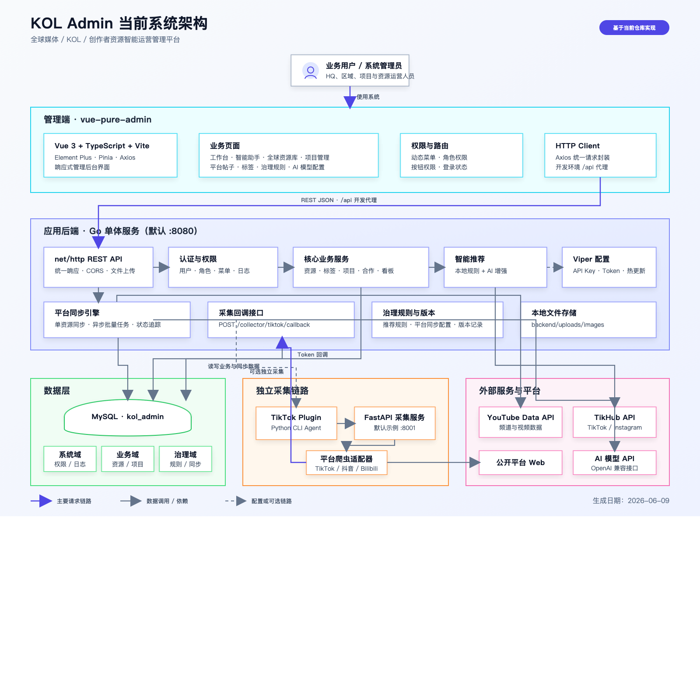

# KOL Admin 系统架构

> 本文档基于当前仓库实现生成。

## 组件职责

| 组件 | 当前职责 |
| --- | --- |
| `vue-pure-admin` | 管理端页面、动态菜单权限、业务操作和数据展示 |
| `backend/cmd/server` | REST API、认证授权、业务逻辑、治理规则、平台同步、采集回调 |
| `backend/migrations` | MySQL 系统域、业务域、治理域和同步域表结构 |
| `collector-plugins/tiktok-web` | 编排 TikTok 采集并将标准化数据回传后端 |
| `collector-services/Douyin_TikTok_Download_API` | 提供 TikTok、抖音、Bilibili 等公开数据采集 API |
| YouTube Data API / TikHub API | 为 Go 同步引擎提供外部平台账号及帖子数据 |
| AI 模型 API | 在本地规则推荐基础上增强推荐理由和排序结果 |

## 架构边界

- 前端不直接访问数据库、外部平台 API 或 AI 模型，统一通过 Go 后端。
- Go 后端是核心业务与权限边界，同时承担同步任务调度；当前没有独立消息队列。
- TikTok 独立采集链路通过共享 Token 回调，和用户登录鉴权相互独立。
- 推荐功能始终先执行本地规则；AI 不可用时可降级为本地规则推荐。
- 外部平台凭证、AI Key 与采集 Token 由后端配置管理，不应暴露给前端。
